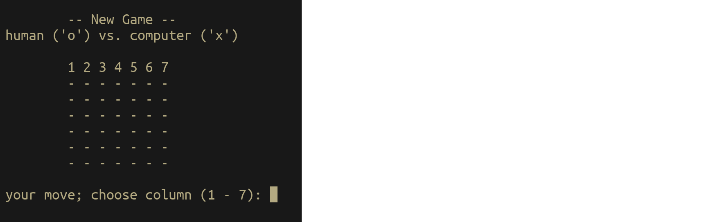
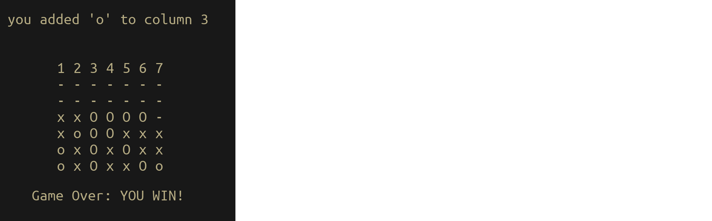

# connect_four
[connect 4](https://en.wikipedia.org/wiki/Connect_Four) in the terminal: RSpec practice

Simon Tharby's solution to [Testing Your Ruby Code](https://www.theodinproject.com/courses/ruby-programming/lessons/testing-your-ruby-code?ref=lnav) (2nd exercise), Odin Project:

## game-play:

The game starts with an empty 'grid' and an invitation to the player to choose which grid column to 'drop' a 'piece' into:

In the example below, in the first round, a human player has chosen to 'drop' a piece into column 3 and the computer has 'chosen' to 'drop' a piece into column 6:

After each round (human move + computer move) the grid is redrawn and another human input requested. This continues until a player wins by creating a line (horizontal, vertical, or diagonal) of 4 of the player's pieces, as in the example below, (Note the uppercase highlighting of the winning line-of-four):

Or until a draw occurs, when the grid is full, but no line of four has been created by either player:

Note that it is possible to create one, two, or three lines of four with a single winning move. The following example is of a win where the last move created 3 winning lines:

## code organization:

The app uses only 2 classes: Grid, and Game (which creates one instance of Grid)

[game.rb](https://github.com/jinjagit/connect_four/blob/game-win/game.rb) creates a new instance of Game, which begins a game. When a game finishes, game.rb prompts the user for input "Play again? (y / n)". 'y' will loop to playing further games, until 'n' is chosen, whereupon the program exits.

#### <code>Grid:</code>

Initializes an empty grid position, <code>\@posn</code> == an array of 7 arrays of 6 '-' characters'.

Contains methods for printing <code>\@posn</code> to the terminal, for referring to each horizontal, vertical and diagonal 'line' of \@posn, and using the former to check for winning positions.

<code>Grid.find_fours</code> passes (sets of references to) every column, row, and diagonal (of length 4 or more) to <code>find_four</code> (note the singular);

<code>Grid.find_four</code> Looks for a winning 'line' (of 4 consecutive pieces belonging to the same player) in an array (of references to a column, row, or diagonal in <code>\@posn</code>). If such a winning line is found, the same definition also changes the character values of the referenced characters in <code>\@posn</code> to uppercase (to highlight the winning line), and <code>\@line_of_four</code> is set to a string value that discriminates the winning player.

#### <code>Game:</code>

Initializes <code>\@grid</code> = a new instance of Grid

Prints an empty grid (which involves calling <code>\@grid.print_posn</code>) at application start, and prompts user for input (a choice of grid column; an integer between 1 and 7, inclusively).

<code>Game.play</code> calls play_round repetitively, until either a win is detected or the game is drawn. It then calls print_result, which prints the appropriate result (including calling <code>\@grid.print_posn</code> again to get a new version of the position with the winning line(s) highlighted by uppercase characters, in the case of a win).

<code>Game.play_round</code> uses <code>\@grid.find_fours</code> to check for a win after every player 'move'. If none is found it then calls <code>create_computer_move</code>, and if the computer move also does not produce a winning position, it calls <code>print_round</code>, which prints the position resulting from the round and prompts the user for the next move.

## RSpec tests

The image below shows the output of running <code>rspec</code> (which uses the examples in [game_spec.rb](https://github.com/jinjagit/connect_four/blob/game-win/spec/game_spec.rb)):

### Methods with no / insufficient tests:

<code>Game.play</code> includes a conditional loop, and I don't know how to write an RSpec test for this case (nor if I need to). No tests.

<code>Game.play_round</code> includes a call to a method that loops until valid user input is given. No tests. See next issue;

<code>Game.until_move_input_valid</code> Only the trivial case where the first user input is valid is tested. This method contains a loop that calls a check on the user input and prompts for further user inputs if the last input was 'invalid'. I don't know how to mock a series of <code>input = gets.chomp</code> events, nor how to deal with conditional loops in RSpec.

<code>Game.print_game_start</code> Since this uses <code>Grid.print_posn</code> in the middle of print statements, I cannot 'expect' a simple std.out multi-line string to be its resulting action (though in effect, it is only concerned with a print routine). Using a <code>Grid</code> double doesn't seem an option that will solve this issue.

<code>Game_print_round</code> Same issue as for Game.print_game_start, above.

<code>Game.print_result</code> Same issue as for Game.print_game_start, above.
