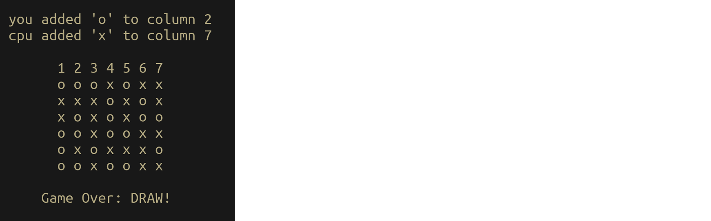

# connect_four
[connect 4](https://en.wikipedia.org/wiki/Connect_Four) in the terminal: RSpec practice

Simon Tharby's solution to [Testing Your Ruby Code](https://www.theodinproject.com/courses/ruby-programming/lessons/testing-your-ruby-code?ref=lnav) (2nd exercise), Odin Project:

## game-play:

The game starts with an empty 'grid' and an invitation to the player to choose which grid column to 'drop' a 'piece' into:

In the example below, in the first round, a human player has chosen to 'drop' a piece into column 3 and the computer has 'chosen' to 'drop' a piece into column 6:

After each round (human move + computer move) the grid is redrawn and another human input requested. This continues until a player wins by creating a line (horizontal, vertical, or diagonal) of 4 of the player's pieces, as in the example below, (Note the uppercase highlighting of the winning line-of-four):

Or until a draw occurs, when the grid is full, but no line of four has been created by either player:

Note that it is possible to create one, two, or three lines of four with a single winning move. The following example is of a win where the last move created 3 winning lines:

## code organization:

The app uses only 2 classes: Grid, and Game (which creates one instance of Grid)

#### Grid:

Initializes an empty grid position, \@posn == an array of 7 arrays of 6 '-' characters'.

Contains methods for printing \@posn to the terminal, for referring to each horizontal, vertical and diagonal 'line' of \@posn, and using the former to check for winning positions.

Grid.find_fours passes (sets of references to) every column, row, and diagonal (of length 4 or more) to find_four (note the singular);

Grid.find_four: Looks for a winning 'line' (of 4 consecutive pieces belonging to the same player) in an array (of references to a column, row, or diagonal in \@posn). If such a winning line is found, the same definition also changes the character values of the referenced characters in \@posn to uppercase (to highlight the winning line), and \@line_of_four is set to a string value that discriminates the winning player.

#### Game:

Initializes \@grid == a new instance of Grid

Prints an empty grid (which involves calling \@grid.print_posn) at application start, and prompts user for input (a choice of grid column; an integer between 1 and 7, inclusively).

Game.play calls play_round repetitively, until either a win is detected or the game is drawn. It then calls print_result, which prints the appropriate result (including calling \@grid.print_posn again to get a new version of the position with the winning line(s) highlighted by uppercase characters, in the case of a win).

Game.play_round uses \@grid.find_fours to check for a win after every player 'move'. If none is found it then calls create_computer_move, and if the computer move also does not produce a winning position, it calls print_round, which prints the position resulting from the round and prompts the user for the next move.

## RSpec tests

The image below shows the output of running <code>rspec</code> (which uses the examples in [game_spec.rb](https://github.com/jinjagit/connect_four/blob/game-win/spec/game_spec.rb)):

